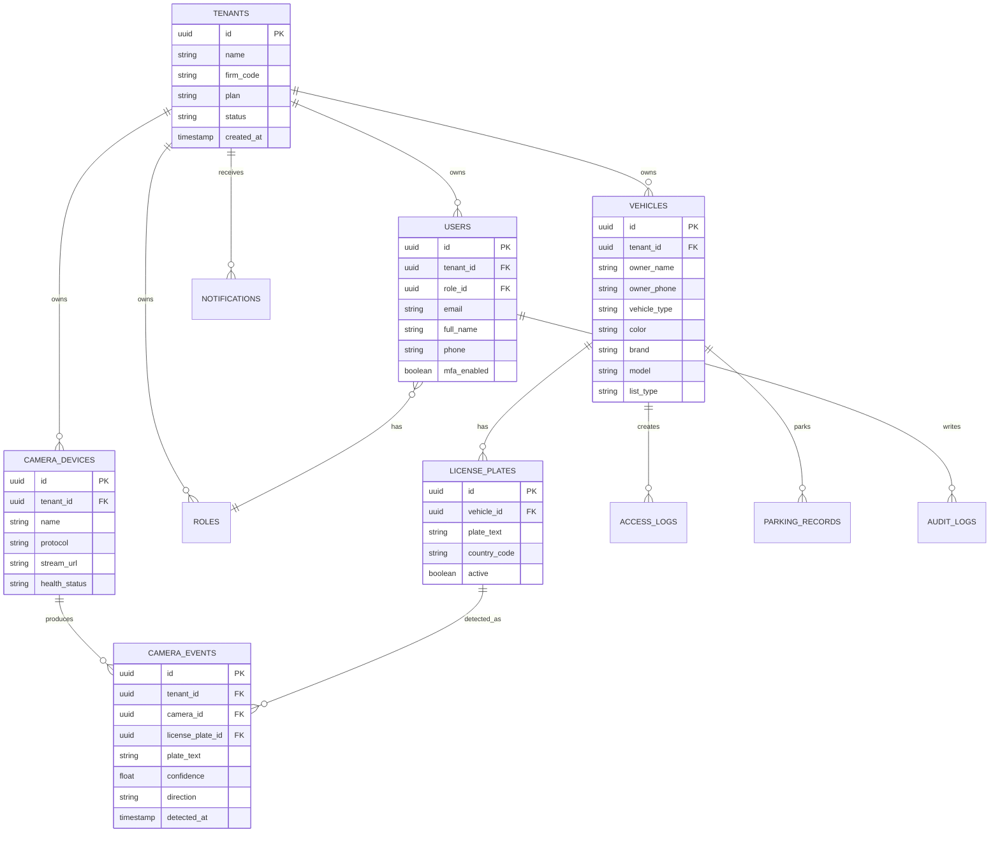

# Akilli Plaka Tanima ve Arac Takip Platformu

## 1. Sistem Mimarisi

Platform, cok kiracili SaaS mimarisiyle tasarlanir. Her firma/kurum bir `tenant` olarak ayrilir. Tum veri erisimi tenant izolasyonu, RBAC ve audit log ile kontrol edilir.

Ana katmanlar:

- Web Dashboard: Admin ve firma panelleri
- Mobil Uygulama: Android/iOS bildirim, sorgu ve alarm yonetimi
- API Gateway: Kimlik dogrulama, rate limit, routing
- Mikroservisler: Auth, Tenant, Camera, LPR, OCR, Vehicle, Notification, Reporting, Audit
- AI Pipeline: Kamera stream alma, arac tespiti, plaka tespiti, OCR, siniflandirma
- Veri Katmani: PostgreSQL, Redis, object storage
- Mesajlasma: Kafka/RabbitMQ ile event tabanli akis

Veri akisi:

1. Kamera RTSP/ONVIF/WebRTC ile stream gonderir.
2. Camera Service stream sagligini izler.
3. LPR Service kareleri isler ve arac/plaka bolgesini tespit eder.
4. OCR Service plaka metnini uretir.
5. Vehicle Service whitelist/blacklist/tenant kayitlarini kontrol eder.
6. Notification Service alarm, SMS, e-posta, mobil bildirim uretir.
7. Reporting Service rapor ve istatistikleri hazirlar.

## 2. ER Diagram



## 3. Veritabani Semasi

```sql
CREATE TABLE tenants (
    id UUID PRIMARY KEY,
    name VARCHAR(180) NOT NULL,
    firm_code VARCHAR(32) UNIQUE NOT NULL,
    plan VARCHAR(32) NOT NULL DEFAULT 'standart',
    status VARCHAR(32) NOT NULL DEFAULT 'active',
    created_at TIMESTAMPTZ NOT NULL DEFAULT now()
);

CREATE TABLE roles (
    id UUID PRIMARY KEY,
    tenant_id UUID REFERENCES tenants(id),
    name VARCHAR(80) NOT NULL,
    permissions JSONB NOT NULL DEFAULT '[]'
);

CREATE TABLE users (
    id UUID PRIMARY KEY,
    tenant_id UUID REFERENCES tenants(id),
    role_id UUID REFERENCES roles(id),
    email VARCHAR(180) UNIQUE NOT NULL,
    password_hash TEXT NOT NULL,
    full_name VARCHAR(160),
    phone VARCHAR(40),
    mfa_enabled BOOLEAN NOT NULL DEFAULT false,
    created_at TIMESTAMPTZ NOT NULL DEFAULT now()
);

CREATE TABLE vehicles (
    id UUID PRIMARY KEY,
    tenant_id UUID NOT NULL REFERENCES tenants(id),
    owner_name VARCHAR(160),
    owner_phone VARCHAR(40),
    vehicle_type VARCHAR(64),
    color VARCHAR(64),
    brand VARCHAR(80),
    model VARCHAR(80),
    list_type VARCHAR(32) NOT NULL DEFAULT 'standard',
    created_at TIMESTAMPTZ NOT NULL DEFAULT now()
);

CREATE TABLE license_plates (
    id UUID PRIMARY KEY,
    vehicle_id UUID NOT NULL REFERENCES vehicles(id),
    plate_text VARCHAR(32) NOT NULL,
    country_code VARCHAR(8),
    active BOOLEAN NOT NULL DEFAULT true,
    UNIQUE(vehicle_id, plate_text)
);

CREATE TABLE camera_devices (
    id UUID PRIMARY KEY,
    tenant_id UUID NOT NULL REFERENCES tenants(id),
    name VARCHAR(120) NOT NULL,
    protocol VARCHAR(32) NOT NULL,
    stream_url TEXT NOT NULL,
    location JSONB,
    health_status VARCHAR(32) NOT NULL DEFAULT 'unknown',
    last_seen_at TIMESTAMPTZ
);

CREATE TABLE camera_events (
    id UUID PRIMARY KEY,
    tenant_id UUID NOT NULL REFERENCES tenants(id),
    camera_id UUID NOT NULL REFERENCES camera_devices(id),
    license_plate_id UUID REFERENCES license_plates(id),
    plate_text VARCHAR(32) NOT NULL,
    confidence NUMERIC(5,2),
    vehicle_type VARCHAR(64),
    vehicle_color VARCHAR(64),
    brand_guess VARCHAR(80),
    model_guess VARCHAR(80),
    direction VARCHAR(32),
    image_url TEXT,
    detected_at TIMESTAMPTZ NOT NULL
);

CREATE TABLE access_logs (
    id UUID PRIMARY KEY,
    tenant_id UUID NOT NULL REFERENCES tenants(id),
    vehicle_id UUID REFERENCES vehicles(id),
    camera_event_id UUID REFERENCES camera_events(id),
    access_type VARCHAR(16) NOT NULL,
    decision VARCHAR(32) NOT NULL,
    created_at TIMESTAMPTZ NOT NULL DEFAULT now()
);

CREATE TABLE parking_records (
    id UUID PRIMARY KEY,
    tenant_id UUID NOT NULL REFERENCES tenants(id),
    vehicle_id UUID REFERENCES vehicles(id),
    entry_event_id UUID REFERENCES camera_events(id),
    exit_event_id UUID REFERENCES camera_events(id),
    entry_at TIMESTAMPTZ NOT NULL,
    exit_at TIMESTAMPTZ,
    fee NUMERIC(12,2) DEFAULT 0
);

CREATE TABLE notifications (
    id UUID PRIMARY KEY,
    tenant_id UUID NOT NULL REFERENCES tenants(id),
    type VARCHAR(32) NOT NULL,
    channel VARCHAR(32) NOT NULL,
    title VARCHAR(160),
    body TEXT,
    status VARCHAR(32) NOT NULL DEFAULT 'pending',
    created_at TIMESTAMPTZ NOT NULL DEFAULT now()
);

CREATE TABLE audit_logs (
    id UUID PRIMARY KEY,
    tenant_id UUID REFERENCES tenants(id),
    user_id UUID REFERENCES users(id),
    action VARCHAR(120) NOT NULL,
    entity_type VARCHAR(80),
    entity_id UUID,
    metadata JSONB,
    created_at TIMESTAMPTZ NOT NULL DEFAULT now()
);
```

## 4. API Tasarimi

Auth:

- `POST /auth/login`
- `POST /auth/refresh`
- `POST /auth/logout`
- `POST /auth/mfa/verify`

Tenant:

- `GET /tenants`
- `POST /tenants`
- `GET /tenants/{id}`
- `PATCH /tenants/{id}`
- `PATCH /tenants/{id}/plan`

Vehicles:

- `GET /vehicles`
- `POST /vehicles`
- `GET /vehicles/{id}`
- `PATCH /vehicles/{id}`
- `DELETE /vehicles/{id}`
- `PATCH /vehicles/{id}/list-type`

Cameras:

- `GET /cameras`
- `POST /cameras`
- `PATCH /cameras/{id}`
- `DELETE /cameras/{id}`
- `POST /cameras/discover`
- `GET /cameras/{id}/health`

LPR Events:

- `GET /events`
- `GET /events/live`
- `GET /events/{id}`
- `POST /events/simulate`

Parking:

- `GET /parking/status`
- `GET /parking/records`
- `POST /parking/manual-entry`
- `POST /parking/manual-exit`

Reports:

- `GET /reports/daily`
- `GET /reports/weekly`
- `GET /reports/monthly`
- `POST /reports/export`

Notifications:

- `GET /notifications`
- `PATCH /notifications/{id}/read`
- `POST /notifications/test`

## 5. Dashboard Tasarimi

Admin Dashboard:

- Firmalar
- Yeni Firma
- Analiz
- Paket/plan yonetimi
- Sistem sagligi
- Tenant bazli kullanim istatistikleri

Firma Dashboard:

- Widget tabanli ana ekran
- Toplam kayitli plaka
- Gunluk giris
- Gunluk cikis
- Anlik icerideki arac
- Kara liste
- VIP arac
- Ziyaretci arac
- En yogun saatler
- Kamera saglik durumu
- Sistem performansi
- Canli izleme
- Araclar
- Personel
- Etiketler
- Raporlar

## 6. Mikroservis Yapisi

- Auth Service: JWT, refresh token, MFA, RBAC
- Tenant Service: firma/plan/limit yonetimi
- Camera Service: RTSP, ONVIF, HLS, WebRTC, kamera sagligi
- LPR Service: stream isleme, arac/plaka tespiti
- OCR Service: EasyOCR/PaddleOCR sonuc uretimi
- Vehicle Service: arac, plaka, kara/beyaz liste
- Notification Service: SMS, e-posta, mobil, WhatsApp
- Reporting Service: PDF, Excel, CSV
- Audit Service: kullanici hareketleri ve guvenlik loglari

## 7. Docker Yapisi

```yaml
services:
  api-gateway:
    build: ./services/api-gateway
    ports:
      - "8080:8080"

  auth-service:
    build: ./services/auth-service

  tenant-service:
    build: ./services/tenant-service

  camera-service:
    build: ./services/camera-service

  lpr-service:
    build: ./services/lpr-service
    deploy:
      resources:
        reservations:
          devices:
            - capabilities: ["gpu"]

  ocr-service:
    build: ./services/ocr-service

  vehicle-service:
    build: ./services/vehicle-service

  notification-service:
    build: ./services/notification-service

  reporting-service:
    build: ./services/reporting-service

  postgres:
    image: postgres:16
    environment:
      POSTGRES_DB: lpr_platform
      POSTGRES_USER: lpr
      POSTGRES_PASSWORD: lpr_password
    volumes:
      - postgres_data:/var/lib/postgresql/data

  redis:
    image: redis:7

  kafka:
    image: bitnami/kafka:latest

volumes:
  postgres_data:
```

## 8. Kubernetes Yapisi

```yaml
apiVersion: apps/v1
kind: Deployment
metadata:
  name: lpr-service
spec:
  replicas: 2
  selector:
    matchLabels:
      app: lpr-service
  template:
    metadata:
      labels:
        app: lpr-service
    spec:
      containers:
        - name: lpr-service
          image: registry.example.com/lpr-service:latest
          ports:
            - containerPort: 8080
          resources:
            limits:
              nvidia.com/gpu: 1
              memory: "4Gi"
              cpu: "2"
---
apiVersion: v1
kind: Service
metadata:
  name: lpr-service
spec:
  selector:
    app: lpr-service
  ports:
    - port: 8080
      targetPort: 8080
```

Kubernetes bilesenleri:

- Namespace: `lpr-prod`, `lpr-staging`
- Ingress: TLS 1.3 destekli API Gateway
- HPA: API ve AI servisleri icin otomatik olcekleme
- ConfigMap: servis ayarlari
- Secret: JWT key, DB sifresi, entegrasyon anahtarlari
- PVC: PostgreSQL ve model dosyalari
- Node pool: GPU destekli AI node grubu

## 9. Sprint Plani

Sprint 1:

- Tenant modeli
- Auth/RBAC
- Admin firma yonetimi
- Temel dashboard

Sprint 2:

- Kamera kayitlari
- RTSP/ONVIF baglanti
- Kamera saglik kontrolu
- Canli izleme taslagi

Sprint 3:

- LPR pipeline
- Plaka OCR
- Kamera event kaydi
- Arac sorgulama

Sprint 4:

- Kara liste/beyaz liste
- Alarm sistemi
- Bildirim altyapisi
- Mobil bildirim

Sprint 5:

- Otopark giris/cikis
- Icerideki arac sayisi
- Sure/ucret hesaplama
- Raporlama

Sprint 6:

- Harita entegrasyonu
- AI arac siniflandirma
- Sistem performans metrikleri
- Kurumsal hardening

## 10. Kurumsal Teknik Dokumantasyon

Guvenlik:

- JWT access token
- Refresh token rotasyonu
- MFA
- RBAC
- Audit log
- AES-256 veri sifreleme
- TLS 1.3
- Tenant izolasyonu

AI Modulu:

- YOLO ile arac/plaka tespiti
- OpenCV ile goruntu iyilestirme
- EasyOCR/PaddleOCR ile OCR
- TensorFlow/PyTorch ile renk, marka, model tahmini
- Supheli hareket analizi icin event pattern detection

Kamera Destegi:

- RTSP
- ONVIF
- HLS
- WebRTC
- Hikvision
- Dahua
- Uniview
- Axis
- Reolink
- Hanwha

Raporlama:

- Gunluk, haftalik, aylik, yillik rapor
- PDF, Excel, CSV export
- Tenant bazli veri filtreleme
- Yetkiye gore rapor gorunurlugu

Gelecek Surumler:

- Emniyet entegrasyonu
- Sehir guvenlik agi entegrasyonu
- Trafik yogunlugu analizi
- Ortalama hiz tespiti
- Kirmizi isik ihlali tespiti
- Serit ihlali tespiti
- Yapay zeka destekli suc analizi
